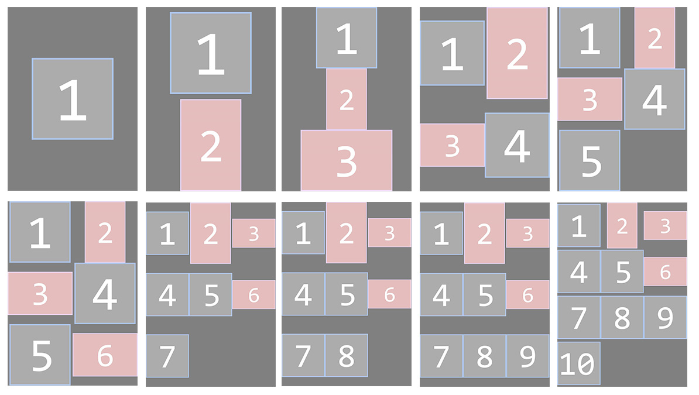

# cs-image-bundle-for-print
A c# console program for bundle images on a singel A4 contact sheet.

# How to use
Drop selected images to exe and it will mount them on a A4 image size at 96dpi ready for print.
It will scale down images if needed to fit there given space on the contact sheet.

# Output examples

